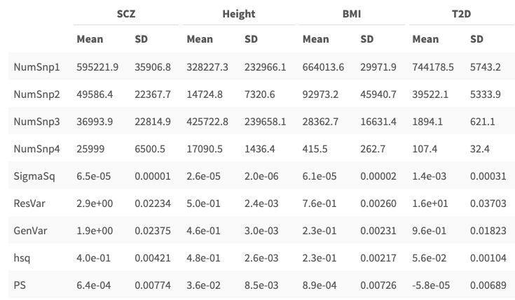

```{r,  message=FALSE, warning=FALSE}
# You need these libraries to run this template:
library(rmarkdown)    # install.packages("rmarkdown") 
library(epuRate)      # devtools::install_github("holtzy/epuRate", force=TRUE)
library(data.table)
library(ggplot2)
library(ggpubr)
library(kableExtra)
library(gtools)
```


<br><br>

***

This is a pipeline to generate SBayesR predictors from summary statistics and calculate PRS for target data. The target data need to be QCed and imputed beforehand. If the data set includes some phenotype, we can compare the PRS to phenotype, and sometimes do case/control comparisons. If the data set are all samples with certain disease, we would like to have a benchmark data set to compare with. It's ideal that the control data set could come from a random selection of population.  


# Control data

If we have a control data set to benchmark the target data, we would like to keep only the SNPs that are shared between them. 


```{r get shared SNPs, engine='sh', eval = F}
awk '{print $2}' Benchmark_Data_maf0.1_cleaned.bim | sort > Benchmark_Data_maf0.1_SNPs.txt 
awk '{print $2}' Target_Data_imputed_cleaned_0.8_maf0.1.bim | sort > Target_Data_imputed_cleaned_0.8_maf0.1_SNPs.txt
comm -12 Benchmark_Data_maf0.1_SNPs.txt   Target_Data_imputed_cleaned_0.8_maf0.1_SNPs.txt  > common.SNPs.txt
```


# QC of GWAS data

After collecting the GWAS summary data to use as predictor, we will QC each GWAS data by 

>1. select the SNPs overlapping with our Target data and benchmark data. (This step can be achieved in SBayesR using --extract common.SNPs.txt)
>
>2. remove allele frequency outliers.
>
>3. remove per-SNP sample size outliers. 


It's very important to input the GWAS summary data in the correct format. Including extra columns will break the lines and lose some proportion of SNPs in analysis. This is the correct format:

> SNP	A1	A2	frq	b	se	P	N  
> rs1000000	A	G	0.2219	1e-04	0.0021	0.96	689928   
> rs10000012	C	G	0.8634	0.0047	0.0025	0.057	692463   
> rs10000023	T	G	0.5817	-0.0047	0.0018	0.0072	676691   
> rs1000003	A	G	0.8404	0.0029	0.0024	0.23	690549   

## check out allele frequency

```{r gwas qc , eval = F}
original.gwas = data.frame(fread("original_GWAS/formatted_clozuk_pgc_meta_gwas", header = T, showProgress = F))
gwas = original.gwas[original.gwas$SNP %in%qced.common.snps$SNP,]

# check allele frequency
gwas$ukb.maf = ukb.maf[match(gwas$SNP, ukb.maf$SNP),"AF"]
gwas$ukb.allele =  ukb.maf[match(gwas$SNP, ukb.maf$SNP),"A1"]

gwas$ukb.ref = NA
gwas[which(gwas$A1 == gwas$ukb.allele), ]$ukb.ref = gwas[which(gwas$A1 == gwas$ukb.allele) , "ukb.maf" ]
gwas[which(gwas$A2 == gwas$ukb.allele), ]$ukb.ref = (1 - gwas[which(gwas$A2 == gwas$ukb.allele) , "ukb.maf" ])
gwas$outlier = (abs(gwas$freq - gwas$ukb.ref) > 0.08 )

ggplot(data=gwas, aes(x=freq, y=ukb.ref, color = outlier)) + 
  geom_point(size=0.7)  +  
  geom_abline(intercept=0.08, slope=1, color="blue") +  
  geom_abline(intercept=-0.08, slope=1, color="blue")  +
  geom_abline(intercept=0, slope=1, color="red") 

```

<br><br>

An example figure:


## check the distribution of marginal effect size of SNPs

```{r, eval=F}
hist(gwas$b, breaks = 100)
```


## check the distribution of per-SNP sample size


```{r, eval=F}
hist(gwas$N, breaks = 100)
```


Based on the distribution, we could do N size or percentile cutoff.  

## output QCed summary statistics in correct format

We can also keep only SNPs existing in LD matrix in this step. 

```{r, eval = F}
write.table(gwas[which(gwas$N > 50000 & (gwas$SNP %in% common.SNP$SNP )) , 1:8], file ="gwas_formatted_shared.txt", quote = F, sep ="\t", row.names = F)
```

SNPs in this file are included in Target data, Benchmark data, and LD reference. They have similar allele frequency compared to UKB European data. 


# run SBayesR

We used the same default gamma parameter for all the traits except Height, for which we used --gamma 0, 0.0001, 0.001, 1, the same parameter as in [Lloyd-Jones, Zeng et al., 2019](https://www.nature.com/articles/s41467-019-12653-0). 

```{r, engine='sh', eval = F}
#!/bin/bash
#PBS -N SBayesR_gwas
#PBS -l walltime=48:00:00
#PBS -l select=1:ncpus=4:mem=80G

mldm="/shares/compbio/PCTG/SBayesR/ldm_shrunk_ukb_hm3/ukbEURu_hm3_sparse_mldm_list.txt"
trait="gwas"

gctb \
--sbayes R \
--mldm $mldm \
--gwas-summary ${trait}_formatted_shared.txt \
--extract ../QCed_SNP_list.txt  \
--hsq 0.1 \
--chain-length 50000 \
--burn-in 10000 \
--seed 12345 \
--no-mcmc-bin \
--out PRS_SBayesR/${trait}_SBayesR > PRS_SBayesR/${trait}_SBayesR.log 2>&1

```


# examine the SBayesR output


```{r sb.function, eval=F}

SBayesR_output = function(trait, gwas, result.prefix){
gwas = data.frame(fread(gwas.file, showProgress = F))
pred.file = paste0(result.prefix, ".snpRes")
parRes.file = read.table(paste0(result.prefix,".parRes"), skip =2)
parRes.file[1:4,] = round(parRes.file[1:4,], 3)
parRes.file[5,] = round(parRes.file[5,])
parRes.file[7,] = round(parRes.file[7,],3)
parRes.file[c(6,8,9),] = format(parRes.file[c(6,8,9),], format = "e", digits = 2)
predictor = data.frame(fread(pred.file, showProgress = F))
predictor$b = gwas[match(predictor$Name, gwas$SNP) , "b"]
predictor$gwasA1 = gwas[match(predictor$Name , gwas$SNP),"A1"]
predictor$gwas.b = NA
predictor[which(predictor$A1 == predictor$gwasA1),]$gwas.b =  predictor[which(predictor$A1 == predictor$gwasA1),"b"]
predictor[which(predictor$A1 != predictor$gwasA1),]$gwas.b = (-predictor[which(predictor$A1 != predictor$gwasA1),"b"])
effect.plot = ggplot(data=predictor, aes(x=gwas.b, y=A1Effect)) + 
  geom_point(size=0.5, alpha = 0.5)  + 
  geom_abline(intercept=0, slope=1, color="blue")    +
  labs(title=paste0(trait, ", with ", nrow(predictor[which(predictor$A1Effect != 0),])  ," SNPs != 0 , cor = ", cor(x = predictor$b, y = predictor$A1Effect, use = "pairwise.complete.obs" )),  x="GWAS marginal effect", y = "SBayesR Effect size") 

result.list = list(parRes.file, predictor, effect.plot)
return(result.list)
}

```

We can examine the SBayesR output in parameter estimates and compare the predictors with marginal effect size in orignial GWAS summary statistics.

```{r, eval = F, eval=F}

gwas.result = SBayesR_output("gwas",    "original_GWAS/formatted_clozuk_pgc_meta_gwas",  "SBayesR_predictors/gwas_Pardinas_SBayesR")
HET.result = SBayesR_output("Height", "original_GWAS/tr5.Height.ma",                  "SBayesR_predictors/tr5.Height_SBayesR")
BMI.result = SBayesR_output("BMI",    "original_GWAS/tr34.BMI.ma",                    "SBayesR_predictors/tr34.BMI_SBayesR")
T2D.result = SBayesR_output("T2D",    "original_GWAS/ukbEUR_DIA2_common.txt",         "SBayesR_predictors/T2D_ukb_SBayesR")
CARD.result = SBayesR_output("CARD",  "original_GWAS/ukbEUR_CARD_common.txt",         "SBayesR_predictors/CARD_SBayesR")

traits.plots = ggarrange(gwas.result[[3]], HET.result[[3]], BMI.result[[3]], T2D.result[[3]], CARD.result[[3]],  ncol = 2, nrow = 3)
traits.parRes = cbind(gwas.result[[1]], HET.result[[1]], BMI.result[[1]], T2D.result[[1]], CARD.result[[1]])

```





# PRS profiling

We just need to keep three columns from SBayesR output file gwas_SBayesR.snpRes and save it into another file.

```{r, eval = F, engine='sh'}
awk '{print $2, $5, $8 }'  gwas_SBayesR.snpRes  > gwas_SBayesR_predictor.txt
```


PRS can be profiles for all traits and all data set in a loop like this:

```{r, eval = F, echo = T, engine='sh'}
traitArray=("gwas" "Height"  "BMI" "T2D" "CARD" "GORD" "PUD" "GPM" "IBS" "IM" "IBD")
dataArray=("Target_Data_imputed_cleaned_0.8_maf0.1" "Benchmark_Data_maf0.1_cleaned" "ukbEURu_imp_v3_impQC_random5000_Target_Data_extract")

for data in ${dataArray[@]};
  do 
  for trait in  ${traitArray[@]};
      do 
      plink \
      --bfile PLINK_files/$data  \
      --exclude  AF.outlier_between_MND_PD.txt  \
      --score  SBeyesR_predictors/${trait}_SBayesR_predictor.txt  \
      --out PRS/${trait}_SBayesR_${data} 
  done
done

```

# examine PRS

## organize output

We first combine all PRS output files into one table for each data set. 

```{r, eval =F}

traitArray=c("gwas", "Height", "BMI", "T2D",  "CARD" , "GORD", "PUD", "GPM", "IBS", "IM", "IBD")
dataArray=c("Target_Data_imputed_cleaned_0.8_maf0.1", "Benchmark_Data_maf0.1_cleaned", "ukbEURu_imp_v3_impQC_random5000_Target_Data_extract")

for(i in 1:length(dataArray) ){
  target.data =read.table(paste0(dataArray[i], ".fam")) 
  target.data = target.data[,c(1,2)]
  colnames(target.data) = c("FID", "IID")
  for (j in 1:length(traitArray)){
  trait = traitArray[j]
  file.name =  paste0("PRS/",trait, "_SBayesR_", dataArray[i], ".profile")
  profile = read.table(file.name, header = T)
  target.data$new.column = profile[match(target.data$IID, profile$IID),"SCORE"]
  colnames(target.data)[ncol(target.data)] = trait
  }
row.names(target.data) = target.data$IID
target.data = target.data[,3:ncol(target.data)]
write.csv(target.data, file= paste0(dataArray[i], "_all_traits_PRS.csv"))
  }

```

PRS of target data and control data will be standardized with mean and SD of control data. They will still be comparable and in same scale. 

```{r,  eval = F}

target.prs = read.csv("Target_Data_imputed_cleaned_0.8_maf0.1_all_traits_PRS.csv", row.names=1)
control.prs = read.csv("Benchmark_Data_maf0.1_cleaned_all_traits_PRS.csv", row.names = 1)
control.mean = apply(control.prs, 2,  mean)
control.sd = apply(control.prs, 2,  sd)
control.prs.norm = sweep(sweep (control.prs , 2, control.mean) , 2, control.sd, FUN = '/')
target.prs.norm = sweep(sweep (target.prs , 2, control.mean) , 2, control.sd, FUN = '/')
```

## make density plot and display significance test 

Here we compared the PRS between Target data and the benchmark data in density plot.

```{r, eval = F}

control.prs.norm$cohort = "control"
target.prs.norm$cohort = "target"

control.prs.norm.melt = melt(control.prs.norm)
target.prs.norm.melt = melt(target.prs.norm)

prs.norm = rbind(control.prs.norm.melt, target.prs.norm.melt)
prs.norm$cohort = factor(prs.norm$cohort, levels = c("target", "control"))
prs.norm$variable = factor(prs.norm$variable, levels=c("gwas", "Height", "BMI", "T2D", "CARD", "GORD", "PUD", "GPM", "IBS", "IM", "IBD" ))

prs.plot = ggplot(data = prs.norm, aes(x = value)) +
  geom_density(aes(fill = cohort), alpha = 0.3) +
  facet_wrap( ~ variable) 

prs.plot

```


We calculated the p value of difference between target data and benchmark data, and labeled them in the density plot


```{r, fig.height=5, fig.width=10, eval = F}

scz.pv.diff    = formatC(summary(lm(value~cohort, data = prs.norm[which(prs.norm$variable =="SCZ"   ),]))$coefficients["cohortSTEP","Pr(>|t|)"], format = "e", digits = 0)
dep.pv.diff    = formatC(summary(lm(value~cohort, data = prs.norm[which(prs.norm$variable =="MDD"   ),]))$coefficients["cohortSTEP","Pr(>|t|)"], format = "e", digits = 0)
bip.pv.diff    = formatC(summary(lm(value~cohort, data = prs.norm[which(prs.norm$variable =="BIP"   ),]))$coefficients["cohortSTEP","Pr(>|t|)"], format = "e", digits = 0)
height.pv.diff = formatC(summary(lm(value~cohort, data = prs.norm[which(prs.norm$variable =="Height"),]))$coefficients["cohortSTEP","Pr(>|t|)"], format = "e", digits = 0)
bmi.pv.diff    = formatC(summary(lm(value~cohort, data = prs.norm[which(prs.norm$variable =="BMI"   ),]))$coefficients["cohortSTEP","Pr(>|t|)"], format = "e", digits = 0)
t2d.pv.diff    = formatC(summary(lm(value~cohort, data = prs.norm[which(prs.norm$variable =="T2D"   ),]))$coefficients["cohortSTEP","Pr(>|t|)"], format = "e", digits = 0)
card.pv.diff   = formatC(summary(lm(value~cohort, data = prs.norm[which(prs.norm$variable =="CARD"  ),]))$coefficients["cohortSTEP","Pr(>|t|)"], format = "e", digits = 0)
cnt.pv.diff    = formatC(summary(lm(value~cohort, data = prs.norm[which(prs.norm$variable =="CNT"   ),]))$coefficients["cohortSTEP","Pr(>|t|)"], format = "e", digits = 0)
gord.pv.diff   = formatC(summary(lm(value~cohort, data = prs.norm[which(prs.norm$variable =="GORD"  ),]))$coefficients["cohortSTEP","Pr(>|t|)"], format = "e", digits = 0)
pud.pv.diff    = formatC(summary(lm(value~cohort, data = prs.norm[which(prs.norm$variable =="PUD"   ),]))$coefficients["cohortSTEP","Pr(>|t|)"], format = "e", digits = 0)
ibs.pv.diff    = formatC(summary(lm(value~cohort, data = prs.norm[which(prs.norm$variable =="IBS"   ),]))$coefficients["cohortSTEP","Pr(>|t|)"], format = "e", digits = 0)

pv.diff = c(scz.pv.diff ,
  dep.pv.diff ,
  bip.pv.diff ,
  height.pv.diff,
  bmi.pv.diff   ,
  t2d.pv.diff   ,
  card.pv.diff  ,
  cnt.pv.diff ,
  gord.pv.diff,
  pud.pv.diff ,
  ibs.pv.diff 
)


sd.diff = c(
round(summary(lm(value~cohort, data = prs.norm[which(prs.norm$variable =="SCZ"   ),]))$coefficients["cohortSTEP","Estimate"], digits = 2),
round(summary(lm(value~cohort, data = prs.norm[which(prs.norm$variable =="MDD"   ),]))$coefficients["cohortSTEP","Estimate"], digits = 2),
round(summary(lm(value~cohort, data = prs.norm[which(prs.norm$variable =="BIP"   ),]))$coefficients["cohortSTEP","Estimate"], digits = 2),
round(summary(lm(value~cohort, data = prs.norm[which(prs.norm$variable =="Height"),]))$coefficients["cohortSTEP","Estimate"], digits = 2),
round(summary(lm(value~cohort, data = prs.norm[which(prs.norm$variable =="BMI"   ),]))$coefficients["cohortSTEP","Estimate"], digits = 2),
round(summary(lm(value~cohort, data = prs.norm[which(prs.norm$variable =="T2D"   ),]))$coefficients["cohortSTEP","Estimate"], digits = 2),
round(summary(lm(value~cohort, data = prs.norm[which(prs.norm$variable =="CARD"  ),]))$coefficients["cohortSTEP","Estimate"], digits = 2),
round(summary(lm(value~cohort, data = prs.norm[which(prs.norm$variable =="CNT"   ),]))$coefficients["cohortSTEP","Estimate"], digits = 2),
round(summary(lm(value~cohort, data = prs.norm[which(prs.norm$variable =="GORD"  ),]))$coefficients["cohortSTEP","Estimate"], digits = 2),
round(summary(lm(value~cohort, data = prs.norm[which(prs.norm$variable =="PUD"   ),]))$coefficients["cohortSTEP","Estimate"], digits = 2),
round(summary(lm(value~cohort, data = prs.norm[which(prs.norm$variable =="IBS"   ),]))$coefficients["cohortSTEP","Estimate"], digits = 2)
)


ann_text_pvdiff = data.frame(
        variable = factor(c("SCZ",  "MDD", "BIP", "Height", "BMI", "T2D", "CARD",  "CNT",  "GORD", "PUD", "IBS") , levels = c("SCZ",  "MDD", "BIP", "Height", "BMI", "T2D", "CARD",  "CNT",  "GORD", "PUD", "IBS")),
        value = 0.5,
        pv.lables = "p[STEP:controls]",
pv.values = paste0("=",pv.diff),
diff.lable =  "b[STEP:controls]" ,
sd.diff = paste0("=",sd.diff) )

prs.plot.with.pvalue = prs.plot + 
  geom_text(data = ann_text_pvdiff, 
            label = ann_text_pvdiff$pv.lables, 
            y = ann_text_pvdiff$value, 
            nudge_x = 3.5,
            size = 3.5,
            parse = TRUE)  +
  geom_text(data = ann_text_pvdiff, 
            label = ann_text_pvdiff$pv.values, 
            y = ann_text_pvdiff$value - 0.08, 
            nudge_x = 3.5,
            size = 3.5
            ) +
  geom_text(data = ann_text_pvdiff, 
            label = ann_text_pvdiff$diff.lable, 
            y = ann_text_pvdiff$value , 
            nudge_x = -3,
            size = 3.5,
            parse = TRUE
            ) +
  geom_text(data = ann_text_pvdiff, 
            label = ann_text_pvdiff$sd.diff, 
            y = ann_text_pvdiff$value - 0.08, 
            nudge_x = -3,
            size = 3.5
            ) 

prs.plot.with.pvalue
#ggsave(prs.plot.with.pvalue,  filename = "PRS_density_plot_with_pvalue.png", width = 10, height =5 )

```


# compare to real phenotype

## Quantitative traits


PRS are compared to real phenotype in point plot for quantitative traits. 

```{r, eval = F}

target.pheno = read.csv("../phenotype_from_Ian/ymh_heightweight_for genetics.csv", sep="\t")
target.pheno$BMI = 10000* (target.pheno$weight_comb/(target.pheno$height_comb)^2)

target.pheno$height.score = target.prs.norm[match(target.pheno$QIMR.No., row.names(target.prs.norm)), "Height"]
target.pheno$bmi.score = target.prs.norm[match(target.pheno$QIMR.No., row.names(target.prs.norm)), "BMI"]

bmi.score.plot = ggplot(data=target.pheno, aes(x=height_comb, y=height.score)) + geom_point(size=0.7)   +  
  geom_smooth(method='lm')
het.score.plot = ggplot(data=target.pheno[target.pheno$BMI < 40,], aes(x=BMI, y=bmi.score)) + geom_point(size=0.7)   +  
  geom_smooth(method='lm')
ggarrange(bmi.score.plot,het.score.plot, nrow=1, ncol=2 , common.legend= F, labels = c("A", "B") )
```

We can calculate the correlation.

```{r, eval = F}

print("correlation of Height pheno ~ score")
cor(target.pheno$height_comb, target.pheno$height.score,  use = "pairwise.complete.obs")

print("correlation of BMI pheno ~ score")
cor(target.pheno$BMI, target.pheno$bmi.score,  use = "pairwise.complete.obs")

print("correlation of BMI pheno ~ score without the BMI outlier")
cor(target.pheno[target.pheno$BMI < 40,]$BMI, target.pheno[target.pheno$BMI < 40,]$bmi.score,  use = "pairwise.complete.obs")

```

## Case/Control studies

We can examine the accuracy of prediction using AUC in case/control studies

```{r, warning=FALSE,  message=FALSE, eval = F}
prs.norm.eur$cohort = as.factor(prs.norm.eur$cohort)
auc.of.D.traits.eur = c(auc(prs.norm.eur[which(prs.norm.eur$variable =="SCZ"   ),"cohort"], prs.norm.eur[which(prs.norm.eur$variable =="SCZ"   ),"value"]),
  auc(prs.norm.eur[which(prs.norm.eur$variable =="MDD"   ),"cohort"], prs.norm.eur[which(prs.norm.eur$variable =="MDD"   ),"value"]),
  auc(prs.norm.eur[which(prs.norm.eur$variable =="BIP"   ),"cohort"], prs.norm.eur[which(prs.norm.eur$variable =="BIP"   ),"value"]),
  auc(prs.norm.eur[which(prs.norm.eur$variable =="T2D"   ),"cohort"], prs.norm.eur[which(prs.norm.eur$variable =="T2D"   ),"value"]),
  auc(prs.norm.eur[which(prs.norm.eur$variable =="CARD"  ),"cohort"], prs.norm.eur[which(prs.norm.eur$variable =="CARD"  ),"value"]),
  auc(prs.norm.eur[which(prs.norm.eur$variable =="GORD"  ),"cohort"], prs.norm.eur[which(prs.norm.eur$variable =="GORD"  ),"value"]),
  auc(prs.norm.eur[which(prs.norm.eur$variable =="PUD"   ),"cohort"], prs.norm.eur[which(prs.norm.eur$variable =="PUD"   ),"value"]),
  auc(prs.norm.eur[which(prs.norm.eur$variable =="IBS"   ),"cohort"], prs.norm.eur[which(prs.norm.eur$variable =="IBS"   ),"value"]))
auc.of.D.traits.eur = round(auc.of.D.traits.eur, digits = 2)
names(auc.of.D.traits.eur) = c("SCZ",  "MDD", "BIP", "T2D", "CARD",   "GORD", "PUD", "IBS" )

auc.of.D.traits.eur = data.frame(auc.of.D.traits.eur)
auc.of.D.traits.eur
```

Here we show the ROC in two traits where SCZ score should be different between case/control, while IBS should be not relevant. 


```{r, fig.height=5, fig.width=10, eval = F}
library(plotROC)
scz.roc.plot.eur <- ggplot(prs.norm.eur[which(prs.norm.eur$variable =="SCZ"   ),], aes(d = cohort, m = value)) + 
  geom_roc(labels = F) +
  geom_abline(slope=1, intercept=0)
ibs.roc.plot.eur <- ggplot(prs.norm.eur[which(prs.norm.eur$variable =="IBS"   ),], aes(d = cohort, m = value)) + 
  geom_roc(labels = F) +
  geom_abline(slope=1, intercept=0)

ggarrange(scz.roc.plot.eur,ibs.roc.plot.eur,nrow = 1, labels = c("SCZ", "IBS") )
```


